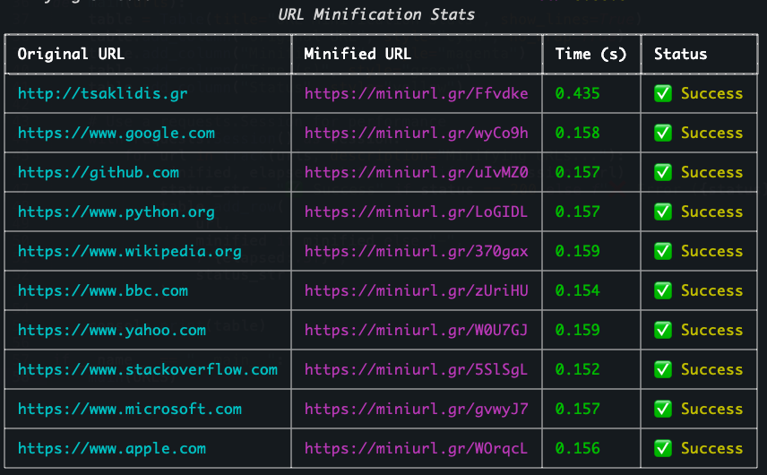

# MiniURL

[](https://www.python.org/)
[](https://sqlmodel.tiangolo.com/)

[](https://github.com/tsaklidis/miniurl.gr/commits/main)

---


## The fastest way to minify your links

MiniURL is a fast, lightweight, and modern URL shortener built with Python and SQLModel. <br>
Easily minify your links with a simple interface.<br>

Because your links deserve to be short and sweet.

## 🚀 Features

- **High-performance link shortening**
- **RESTful API** for programmatic access
- **Admin dashboard** for managing links
- **Click statistics & analytics**
- **Custom aliases** for your links
- **Dockerized deployment**
- **Unit and integration tests** with Codecov reporting

## 📦 Tech Stack

- **Backend:** Python 3.12, FastAPI
- **Cache:** Redis
- **Database:** SQLModel (SQLAlchemy + Pydantic)
- **Containerization:** Docker
- **Testing:** Pytest, Codecov

## 📊 Stats


## 🛠️ Installation

```bash
git clone https://github.com/tsaklidis/miniurl.gr.git
cd miniurl.gr
pip install -r requirements.txt
```

Or run with Docker:

```bash
docker build -t miniurl .
docker run -p 8000:8000 miniurl
```


## 🔗 API Endpoints

- `POST /shorten` — Minify a URL
- `GET /{alias}` — Redirect to the original URL
- `GET /stats/{alias}` — Get click statistics (TODO)

## 💡 Example Usage

```python
import requests

data = {"url": "https://www.example.com"}
response = requests.post("https://miniurl.gr/api/v1.0/minify", json=data)
print(response.json())
```

## 📝 Contributing

Pull requests and issues are welcome!

## 📄 License

Licensed under the [MIT License](LICENSE).

